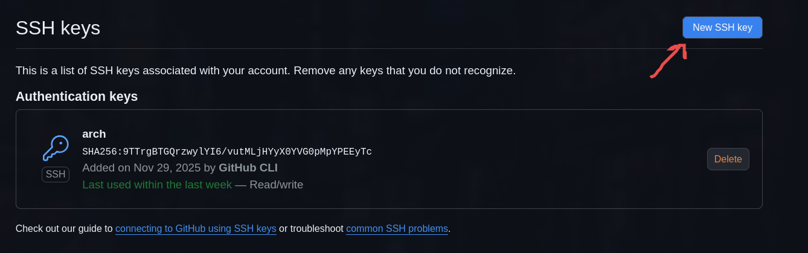
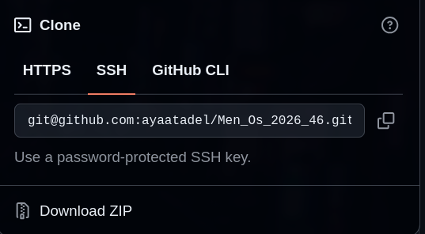

```bash
  ssh-keygen -t ed25519 -C "mahmoudahalim0@gmail.com"
  ssh-add ~/.ssh/id_ed25519
  cat ~/.ssh/id_ed25519.pub
```

then copy the public key and paste it on github




then click add SSH key

now you can push to your repos without signing in
note: you need to add the ssh url as remote not the https for this to work

