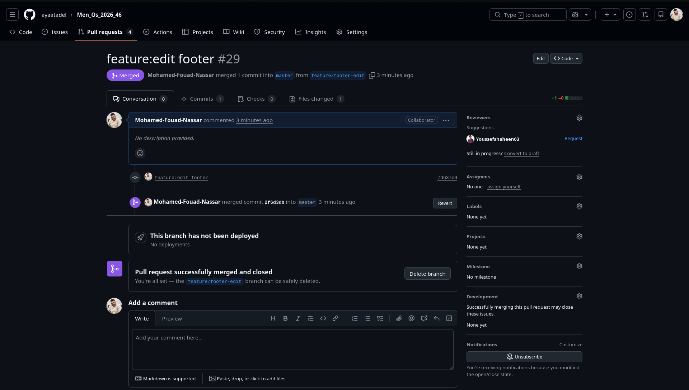

# Day 2 - Rest Tasks

## New Branch Task:

add branch called feature/edit-footer

---

## SSH vs HTTP Task:

comparison file is [SSH VS HTTP](./ssh_vs_http.txt)

---

## Organization Task:

I create this organization: [My Org](https://github.com/iti-co) with two repos:

1. ES6 project [here](https://github.com/iti-co/ES6-project)

2. Repo Two [here](https://github.com/iti-co/repo-2)

with adding some of my colleges in org and change their privileges in org.
